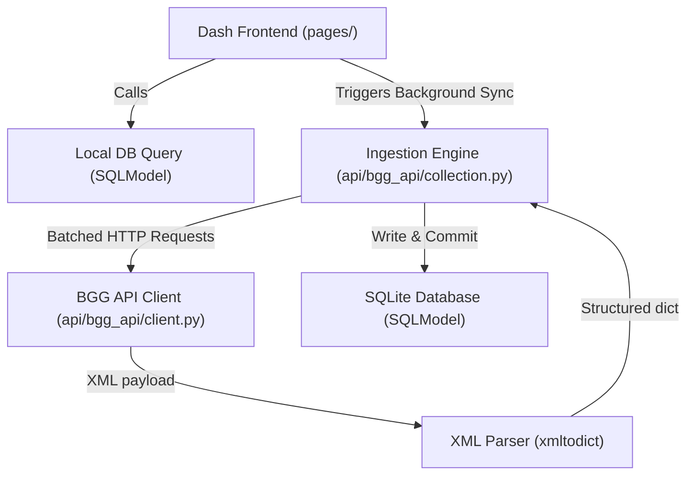
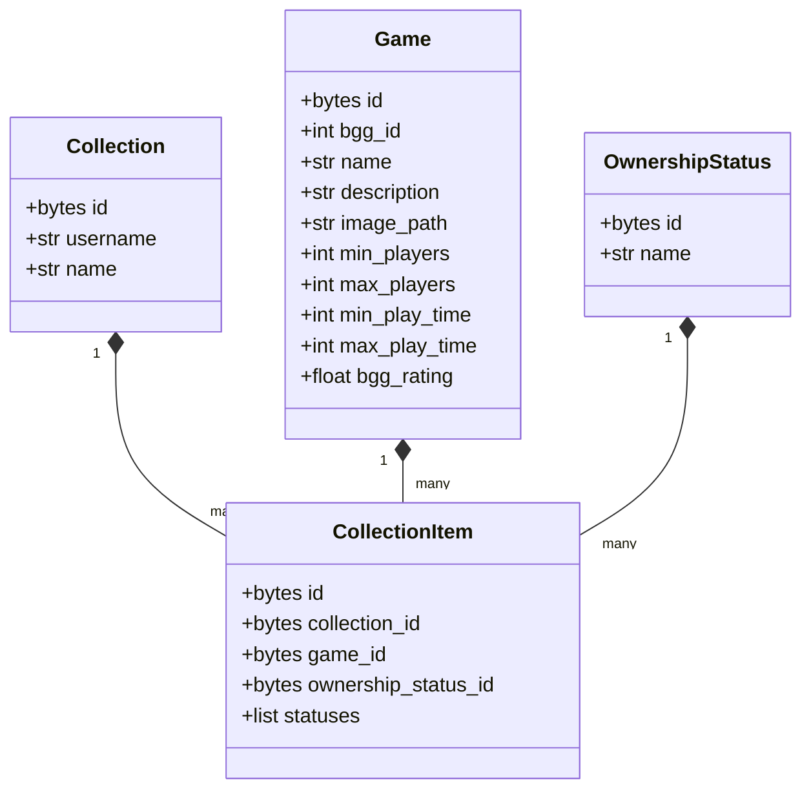

# Spielpendium API & Developer Reference

This document provides a comprehensive reference of Spielpendium's internal codebase, modules, databases, and schemas.
It serves as a guide for developers wanting to extend the application, add new visual stats, or interface with the
database.

---

## 1. Module Architecture Overview

Spielpendium is divided into two primary areas:

1. **Frontend / View Components**: Built with Dash and Dash Mantine Components.
2. **Backend API Client & Database Service (`api/bgg_api/`)**: Manages calls to the BoardGameGeek API and database
   persistence.



### Ingestion Modules

#### `client.py` (`api/bgg_api/client.py`)

Provides HTTP interactions with BGG's public XML API2.

- **Key Function**: `get_xml_info(url, query=None) -> dict[str, Any]`
  - Standardized fetching function with rate-limit resilient retry handlers.
  - Implements **exponential backoff** when encountering HTTP `429 Too Many Requests`.
  - Handles BGG's async queue responses (`HTTP 202 Accepted`) by sleeping and retrying.
- **Key Function**: `search_bgg(search_query, exact_flag=False) -> dict[str, Any]`
  - Performs title searches.

#### `game_details.py` (`api/bgg_api/game_details.py`)

Processes detailed BGG metadata.

- **Key Function**: `get_game_info(game_ids: list[int], ...) -> dict[str, Any]`
  - Performs batched fetches of extensive game data.
- **Key Function**: `_process_and_save_game_details(session, bgg_id, raw_data) -> tuple[Game, str]`
  - Extracts parameters (player range, age, mechanics, description) and maps them to SQLModel schema.

#### `images.py` (`api/bgg_api/images.py`)

Handles background fetching and local caching of board game graphics.

- Saves BGG cover images into the local `/assets/images/` directory to guarantee high page speed and offline support.

#### `collection.py` (`api/bgg_api/collection.py`)

The primary orchestrator of the background ingestion thread.

- **Key Function**: `get_user_game_collection(username, filters, force_update) -> Collection`
  - Retrieves from DB if cache exists, otherwise starts raw fetch.
- **Key Function**: `save_collection_data_to_db(username, collection_data)`
  - Parses items, checks existing database links, performs batch metadata fetching, and updates the thread-safe
    `SyncStatus` progress tracker.

---

## 2. Shared Utilities (`util/`)

### Settings Engine (`util/settings.py`)

Provides a lightweight key-value database storage system to persist user preferences.

- **`get_setting(keyword, default)`**: Fetches preferred theme (`theme`), accent color (`primary_color`), collection
  page size (`page_size`), layout view (`layout_view`), or auto refresh (`auto_refresh`).
- **`set_setting(keyword, value)`**: Writes preferences instantly to the database.

### Status Tracker (`util/status.py`)

Thread-safe dataclass designed to track active collection syncs across threads.

- Tracks `active`, `current`, `total`, and `message`.
- Managed using a standard Python `threading.Lock`.

---

## 3. Database Schema & SQLModels (`util/models.py`)

Spielpendium uses **SQLModel** (combining Pydantic and SQLAlchemy) for modern, type-safe database schemas.

### Primary Entities



---

## 4. Extending the Schema (Adding New Fields)

To add a new metadata field (e.g. BGG weight/difficulty rating):

1. **Modify `util/models.py`**:
   Add the field to the `Game` class:

   ```python
   class Game(SQLModel, table=True):
       # ... existing fields
       weight: float | None = Field(default=None, nullable=True)
   ```

2. **Update Ingestion Parser (`api/bgg_api/game_details.py`)**:
   Locate `_process_and_save_game_details` and extract the new value:

   ```python
   # Extract the average weight from the BGG statistics payload
   stats = stats_node.get("ratings", {})
   averageweight = stats.get("averageweight", {}).get("@value")
   weight_val = float(averageweight) if averageweight else None
   ```

   Assign it to the game object before committing:

   ```python
   game_obj.weight = weight_val
   ```

3. **Incorporate in UI Layout**:
   The system will automatically initialize the database with the new column on startup. You can now fetch and render
   `g['weight']` on the Collection or Details screens!
