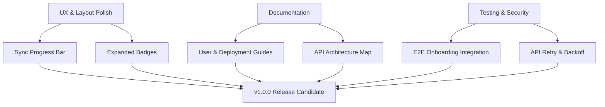

# Roadmap to v1.0.0

This document outlines the remaining milestones, feature polish, test coverage, and documentation required to
transition **Spielpendium** from a development prototype (v0.9.x) to a production-ready **v1.0.0** release.

---

## 1. Feature Completion & User Experience (UX) Polish

### Realtime Sync Progress Feedback (Task 7.3)

Currently, the "Refresh Database" button triggers a background ingestion thread, but the UI only polls the completion
status. We need a live, granular progress bar showing exact ingestion updates.

- **Objective**: Bind `sync-progress-bar` to represent `current / total * 100` dynamically during active syncs.
- **Action**: Modify the background thread in `pages/collection.py` to write progress increments to the DB status or
  cache, allowing `dcc.Interval` to fetch and render the live status (e.g., "Fetched 45 of 120 games...").

### Expanded Ownership Badges (Task 9.1)

Display distinct, visual badges for all board game ownership categories on the game cards and detail views.

- **Objective**: Standardize badge rendering for all BGG collection statuses:
  - *Own* (Green)
  - *Previously Owned* (Gray)
  - *For Trade* (Amber)
  - *Want in Trade* (Teal)
  - *Want To Play* (Purple)
  - *Want To Buy* (Orange)
  - *Preordered* (Blue)
  - *Wishlist* (Pink)
- **Action**: Update `STATUS_BADGE_CONFIG` in `pages/collection.py` to cover all statuses with HSL-tailored colors.

### List and Grid View Toggle

Provide the user with a toggle to switch between a visual card grid and a compact list/table view for large
collections.

- **Objective**: Cater to power users who prefer high-density tabular formats.
- **Action**: Add a view-toggle component to the settings and collection header, storing the preferred view in
  `dcc.Store`.

---

## 2. Advanced Documentation & User Guides

A stable v1.0 release requires comprehensive documentation to enable effortless onboarding and self-hosting.

### User Guide (`docs/USER_GUIDE.md`)

Create a visually rich user guide explaining how to make the most of Spielpendium:

- **Connecting BGG Accounts**: How to find your username, BGG API queue times, and fetching sync statuses.
- **Filtering & Search**: Detailed instructions on player count matching, rating ranges, and multi-category filtering.
- **Theme & Accent Selection**: Setting dark/light modes and managing user preferences.

### Operations and Deployment Guide (`docs/DEPLOYMENT.md`)

Guide self-hosters through deploying Spielpendium in production environments:

- **Production Builds**: Running behind reverse proxies (e.g., Nginx) and WSGI/ASGI servers (Gunicorn/Uvicorn).
- **Dockerization**: A standard `Dockerfile` and `docker-compose.yml` configuration for automated container builds.
- **Database Backups**: How to safely backup, restore, and migrate the underlying SQLite database file.

### API Reference (`docs/API_REFERENCE.md`)

Document the internals of the `api/bgg_api` module and `util/` libraries for future developers:

- **Module Architecture**: Schema overview of `client.py`, `game_details.py`, `images.py`, and `collection.py`.
- **Extending Models**: Guidelines for adding new fields or custom SQLModel tables.

---

## 3. Testing & Robustness Expansion

While our core test suite is highly stable, v1.0 requires comprehensive integration and load testing.

### Load and Performance Testing (`tests/test_performance.py`)

Ensure database queries, collection filters, and card layouts remain responsive under heavy loads.

- **Scenario**: Simulate collections with `1,000+` games and `10,000+` related game relationships.
- **Objective**: Keep database querying and JSON transformations under `100ms`, and page layout rendering under `500ms`.

### End-to-End Onboarding Test (`tests/test_e2e_onboarding.py`)

Simulate the entire user flow in a single automated integration test.

- **Flow**:
  1. User opens the application (empty state, onboarding visible).
  2. User connects their BGG account name.
  3. Background sync starts, fetches fake XML details, and populates the database.
  4. Page updates to render collection grid, filters, and statistics dashboard.

### BGG API Rate-Limit Resilience

- **Objective**: Guard against BGG API rate limits (HTTP 429) during large sync operations.
- **Action**: Implement robust exponential backoff retry handlers inside `api/bgg_api/client.py`.

---

## 4. Operational Milestones for v1.0.0

### Milestone Checklist

- [x] Implement live progress updates in the background ingestion thread.
- [x] Add distinct colors and configuration badges for all 8 BGG ownership statuses.
- [x] Create `docs/USER_GUIDE.md` and `docs/DEPLOYMENT.md` files.
- [x] Set up robust exponential backoff on the HTTP client for BGG.
- [x] Write E2E integration test covering onboarding, collection loading, and stats navigation.
- [x] Ensure 100% compliance with strict pre-commit hooks (formatting, types, markdown linting).
